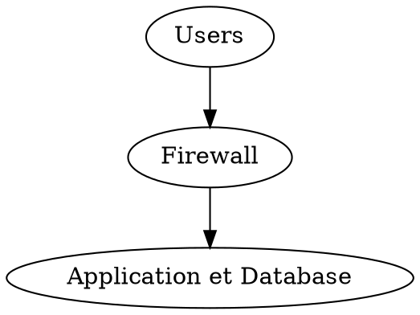
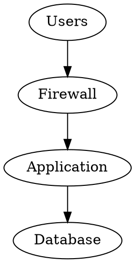
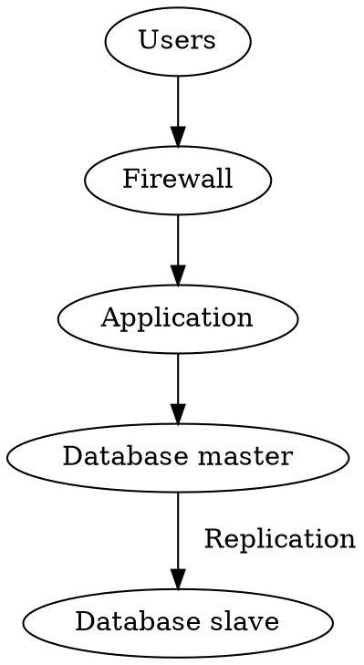

# AWEB - Web architecture

:hammer: Fix me
:warning: Partiels
:books: A lire
:heavy_minus_sign: Inconvénients
:heavy_plus_sign: Avantages

> 24/06/2020

# Formation architectures
## Requirements


- Web app has 2 main components:
    - Processing (the app, *go, rust, js, php, ...*)
    - Storage (usually db, can use call to API REST)
- some other stuff
    - Caches, tech tools, monitoring, ...
    - APM (*New Relic*)
- Une bonne archi peut etre un produit, avec feature et qui coute:
    - Components coupling will impact the cost. Check les versions des différents composants. Essayer d'éviter les composants qui s'assemblent difficilement (mise à jour importante plus souvent)
    - Modularité ultra importante -> mise à jour facile


## Architecture inputs
- Expected traffic:
    - **la seule bonne métrique -> requete par seconde**
    - pas de requete par ping par seconde
- Volume de données -> impacts storage, backup, ...
- Faire attention au budget alloué (setup budget et maintainance budget)
- Plan de backup (daily and realtime)
- Scalability:
    - Horizontal: more nodes
    - Vertical: more hardware
    - Voir en fonction du traffic attendu
- Expected availability
    - Number of "nines"
        - 3 nines -> 99.9% -> 9h de  downtime par an
        - 4 nines -> 99.99% -> 53 min de downtime par an (*c'est cher et ça se vend cher*)
        - 5 nines (Google) -> 99.999% -> 5m de downtime par an
        - Difficile de faire du 99.99 ou plus

## Architecture output
- Une fois que tout est spécifié, on a un DAT (Architecture Specification) -> par les devs pour les devs:
    - High view schema
    - Flow between modules + protocols + flow data volume
    - Composants avec leurs versions, leurs contraintes et la stratégie de roadmap -> quand est-ce qu'il va falloir faire des mises a jour ?
        - Contraintes d'OS (difficile de mettre à jour un composant à cause)
        - Contraintes de support des composants
        - ...
    - Stratégie du cache (CDN, ...)
    - Sécurité
        - Comment je gère la securité?
    - Le stockage et comment on l'utilise (relationnel, ...)
    - CI / CD strategy
    - Deployment strategy
    - Backup strategy
        - evite les downtimes
        - si un serveur tombe, passer automatiquement sur un autre serveur
    - Disaster Recovery Plan (PRA en français)
        - si une météorite tombe sur les serveurs, comment je redéploie tout ?

### Exemple de DAT sur Bein, Viparis

En pré-prod', on **doit** avoir la meme config que en prod' (sauf peut-etre au niveau des données).

## Infrastructure components
- Firewall: block undesired traffic, usually coming from outside to the inside
- DMZ: zone between the external and the internal firewall. **Nothing can go through the DMZ EVER:exclamation:**
    - The whole point is to master what's initiating communication to the inside.
- Some DMZ cannot communicate to the inside, it has to be called *from* the inside:
    - Usually in strategic systems (banque, health, ...)
    - Protege des breches de sécurité à l'intérieur du DMZ
    - Async everything + tout est daté
- NFS: network share
- VPN: network privé securisé, souvent le lien entre DMZ et internal net
- HAProxy: load balancer, level 3 (TCP) or 7 (application)
- Heartbeat: health checker using Virtual IP mechanism
    - si un noeud est down, bascule automatiquement sur un autre noeud

## Architecture components
- HTTP proxy: NGINX / Apache. In charge of HTTPs (ssl), rewrite, ...
- Middlewares: EAI, ESB (entreprise service bus -> bus de communication), 
- Tous ces composants sont mis dans des clusters:
    - Strat si y a un cluster qui tombe
- quand on use des clusters, il ya deux modes:
    - Actif/passif: un seul noeud est up, l'autre est pret a etre lancé
    - Actif/actif: tous les noeuds sont up (coutent plus cher et plus d'effort)
- Evidemment, mettre les noeuds sur des serveurs differents. Si un serveur tombe, on ne veut pas perdre tous les noeuds.

## Architectures examples


master/slave -> Architecture en read/replica.
Quand on utilise un Elastic, il en faut 3... :hammer:


On a un cluster de trois serveurs:
- deux pour le site
- un pour l'administration

## Different types of architecture

### Basic architecture

- :heavy_plus_sign::
    - facile à mettre en place
    - pas cher
- :heavy_minus_sign::
    - pas d'isolation  (*server tombe, on perd tout*)
    - pas de spare (*pas de backup*)
    - not scalable (*si charge monte -> on est foutu*)

### Basic separate architecture

- :heavy_plus_sign::
    - meilleur isolation
- :heavy_minus_sign::
    - pas de spare (*pas de backup*)
    - not scalable (*si charge monte -> on est foutu*)

Bien isolé:
- on peut dimensionner nos serveurs
- on peut plus tard avoir une meilleure montée en charge

### Basic architecture with replicated database

- Replication:
    - si le master tombe, le slave devient le master
    - le slave demande au master les binary logs depuis "tel moment"
    - le slave est un live backer
- :heavy_plus_sign::
    - Better isolation
    - Database spare
- :heavy_minus_sign::
    - not scalable

Le master/slave ne peut scaler qu'en lecture:
- comme on peut lire sur tout le monde, plus on ajoute de slaves, plus on va absorber de charge de lecture.
- on ne peut pas scaler en écriture car il n'y a qu'un seul noeud

On lit 4 fois de plus que l'on écrit.
Techniques:
    - charber (on peut utiliser le calcul de tous les noeuds, bien pour la performance)
    
## Load balancing and failover
- **Load balancing**:
    - Balance request processing between different host
- **Failover**:
    - comment je fais pour re-router le traffic vers un nouveau noeud si y a un crash
    - increase reliability
    - SPOF (Single Point of Failure) are to be avoided -> si y a un noeud qui tombe, tout tombe -> à éviter
    - de préférence, automatiquement revenir à la normale

## Problems with multiple nodes
- besoin de partager l'info entre les différents noeuds
- database:
    - pas de probleme, les serveurs de la db peuvent etre partagés
- session d'utilisateurs:
    - généralement liée à un frontend en particulier
    - comment je fais quand je vais sur un autre noeud pour savoir si je suis bien connecté ?
- fichier média:
    - upload sur un frontend
- cache pas valide:
    - meme probleme que pour les sessions
    - new content purges cache on one frontend, not on all the others -> inconsistency


## User sessions
- Affinité de sessions
    - load balancer va toujours diriger un meme user vers un meme serveur
    - bad behaviours when frontend fails
- Centralisation:
    - En base de données
    - Dans un store dédié (redis, ...)
    - Token JWT
    - :exclamation: Don't create another SPOF
- Distibution entre tous les fronts
    - cluster: multicast new sessions to all frontends

**Stateless** et **Stateful**
- Stateful:
    - lié au serveur front, s'il meurt on perd le state
    - pas besoin d'un autre storage, on utilise la mémoire du noeud courant
    - meme charge sur tous les noeuds
- Stateless:
    - on a besoin d'un storage pour le state
    - pas de data attaché entre nous et le noeud
    - pure scalability of front servers, tant que le storage scale
    - on peut aller sur n'importe quel noeud sur n'importe quel front
- Both are based on a cookie ID, one use to find the node, the other to request the storage

## Media
- centralization
    - database (huge binaries in DB, ...)
    - file share (NFS, Samba, ...) -> le chemin vers ces fichiers là sont mis en bdd
- distribution to all frontends:
    - modify the upload feature to upload to all frontend
    - Use a file replication tool (rsync, ...)

## Cache
- centralization:
    - cache en bdd (pre-computed stuff)
    - storage dédié
        - Memcached (se dit memcache) -> key/value mais pas de sauvegarde
        - Redis -> key/value avec sauvegarde sur le filesystem (en background si besoin)
        - Varnish -> Cache protocol + HTTP cache
- Distribution to all frontend thanks to dedicated tools
    - Mettre un cache et il va etre partagé entre tous ses noeuds
    - EHCache
    - Hazelcast
    - XAP
    - Etcd

## Double frontend, database replication :hammer: 
schema
```graphviz
digraph {
    
}
```

## Multiple frontends :hammer:
schema
## Multiple frontends with read-write split :hammer:
schema

- Avoir la techno qui share le read-only ou le write -> pas de PHP

## Multiple frontend with read balancing :hammer:
schema

> 02/07/2020

## Cloud
- Google Cloud va disparaitre 

Les 3 catégories de Cloud sont **SaaS**, **PaaS** et **IaaS**.
:warning: 

### SaaS:
- Same software for everyone + plugins
- You don't have to deal with anything
- but the customization is limited as you use the same app than everyone (il faut rester dans le standard)
- Salesforces, Google Apps, ...
- Technique de multi-tenancy
- Utilisateur se connecte -> tenant id:
    - Cet id est passé de facon automatique à l'app
    - L'app partout utilise ce tenant id
    - Répartition en base de données
    - Très pratique pour cloisonner la donnée

### PaaS:
- meme plateforme d'exécution pour tout le monde
- on peut développer n'importe quoi qui est autorisé par la plateforme
- Limited to techs the platform allows
- déploiement tres facile mais on n'a pas la main dessus
- Platform.sh, Google App Engine, Heroku, ...
- Suffisant pour la majorité des cas
- iPaaS
- tout ce qui est environnement d'exécution, briques auto-managées
- Pour démarrer des projets très rapidement, c'est top

### IaaS:
- Same physical server for everyone
- You are free to do whatever you like but you are responsible for everything
- Déploiement de la tech qu'on veut
- Les boites qui proposent du IaaS tendent à proposer du PaaS
- AWS, Azure, Google Cloud, Ali Baba Cloud, ...
- on-premise solution with virtualization handled for you
- Très très libre, on peut mettre ce que l'on veut -> mais responsable de tout
- Des toolings systèmes

### Hybride Cloud
- Mélange du on-premise et du cloud
- Problématiques:
    - Gestion des identités entre le cloud et le non-cloud
    - Partage de données par APIs

### Sous-catégories de SaaS, PaaS, IaaS
- DaaS
- ...

### Multi cloud
- Aller chez plusieurs providers cloud et rester indépendant
- Eviter de mettre tous son taff au meme endroit


## Architecture styles
- :books: [Blog de Martin Fowler](https://martinfowler.com/)

### Microservices :hammer:
**Micro-services are a small amount of logic, exposing a stable API and using its own storage.**:
- API est stable, à jour et documentée
- Le stockage est lié au micro-service
- Si on partage le stockage entre plusieurs micro-services, c'est pas des micro-services -> ce sont des modules
- Un stockage par micro-service
- Exemples de microservices:
    - une gestion d'utilisateur
    - une gestion de commande
- Micro-services d'orchestration:
    - micro-services qui appelle d'autres micro-services
    - pas forcément de stockage
- When doing micro-services, you deploy a bunch of small modules, independent from each other
    - Unitairement, plus facile à déployer. Collectivement, c'est compliqué (à cause des dépendances).
    - si un module casse, seul le micro-service est cassé
    - stockage différent par micro-service -> stockage spécifique pour un micro-service spécifique
        - Le stockage qui convient à la problématique du micro-service
    - Polyglotisme très facile à faire (micro-services dans le langage qui faut).
        - On évite de faire ça dans la vraie vie
        - coût non négligeable de maintenir plusieurs stacks/compétences
    - Industrialisation du déploiement
        - qu'on puisse redéployer un micro-service très rapidement
- Here are the drawbacks of micro-services architecture no one talks about (for now):
    - Data is spread across multiple storages, so you have to either duplicate it, or get it and process it with code
        - Lors d'un changement de la data, il faut informer les autres micro-services -> service de messagerie à implém'
    - logs are spread across multiple node, even for a single process. You need to get them in one place to analyze things. Plus, you need a way to group them (process id).
        - service de gestion de logs à implém'
    - Transactions are a nightmare since you can only rollback manually by defining a rollback plan for a cross micro-service transactional operation.
    - You must maintain your API or you will impact everyone and loose the decoupling benefits.
    - With many micro-services, you'll need a gateway (like Netflix Zuul)
- Dans les micro-services, ce sont des microliths.

### Monolithic
Quand on fait pas du micro-service:
- on déploie tout (API, controllers, view, DAO, ...) ou rien
- donc déploiement facile
- Any call is a "_code_" call (method, script, class) and that's a _lot_ easier to debug and to maintain (si c'est bien fait)

## ESB
Entreprise Service Bus

### Focus on ESB
- When connecting a lot of software components, we can end up like this: (*image*)
    - tous les fils au milieu sont uniquement des relations point à point
        - :heavy_minus_sign: point <-> point deviennent vite du point <-> multi-points
    - la doc était bonne un jour puis elle n'a pas été mise à jour donc elle n'est plus à jour
- Tight coupling
- mise à jour d'un composant va impacter les autres en cascade
- tous les déploiements sont cassés et ont un impact sur plein de composants

Utilisation d'un **bus d'entreprise**:
- fournit une abstraction pour les composants
- Pas de connexion vers l'extérieur, souvent qqchose de très interne
- Obligé de mettre du fail over sur du ESB
- no one knows about anyone, only the bus
- the bus is in charge of maintaining API compatibility
- many API version at the same time can be deployed
- service unavailibility strategies
- flow monitoring
- get async for free
- Disadvantages:
    - Single point of failure, tout peut tomber
    - communication plus lente

### ESB main features
- connait tous les protocoles (*AMQP, REST, SOAP, JMS, ...*)
- conversion de format (*xml -> json, soap -> rest*)
- monitoring
- save error for retry
- can define complex routes once and for all, not in all components

### ESB Flow Example


- MuleSoft - Mule ESB (Open source)
- Talent (Open source)
- Axway

### API Manager
- Qu'est ce qu'on veut exposer de l'API au monde ?
- Proche de l'ESB vu que ça expose l'API de l'ESB hors du subnet
- Located in the DMZ
- In charge of:
    - API endpoints
    - Auth & registration
    - throttling (limitation du nombre d'appels)
    - API documentation (Swagger)
    - Proxying with some simplification for the outside world
- Gravitee, Kong, WSO2 API manager, ...


> 16/07/2020


# Data storages
## Schema design

### Normal forms
Les **formes normales** sont des règles qui dictent des choses à respecter quand on modélise une bdd en relationnel pour s'assurer que ce que l'on va faire est vraiment fiable, ACID et surtout manipulable et la modélisation est bonne pour le projet.
- :heavy_plus_sign::
    - fiable, compréhensible et rigide
    - moins de boulot pour le dev
- :heavy_minus_sign::
    - moins de souplesse
    - performance dégradée pour récupérer toutes les infos
    - jointure à faire

Parmi les formes normales les plus connues, on a:
- 1NF: pas de groupe qui se répète
- 2NF: pas de clé qui pourrait etre un attribut primaire et qui ne l'est pas indiqué et qui dépend d'un probleme fonctionnel
- 3NF
- ...

### RDBMS schema design vs noSQL schema design
RDBMS: Relational Database Management System

Quand on fait du noSQL, il faut se dire: "comment je vais exploiter la donnée ?"

RDBMS:
- Normal forms:
    -  respect requires to think in terms of entities
    - do not allow schema design based on per request needs

NoSQL:
- "schemaless" -> notre schema casse les formes normales
- le schema est basée sur les besoins et pas sur les entités

## DBMS principles
DBMS: Database Management System

### Table EAV
- :heavy_plus_sign: beaucoup plus simple pour ajouter des caractéristiques sachant qu'on ne sait pas à l'avance ce que ce sera

Sans EAV:
| id | name | price | pointure |
| -------- | -------- | -------- | ---- |
| 4     | A     | 4.0     |  |
| 5     | B     | 2.4     | 44 |


Avec EAV, on fait une meta-table:
| Entity id | Attribute id | Value |
| -------- | -------- | -------- |
| 4     | 1     | A     |
| 4     | 2     | 4.0     |
| 5     | 1    | B     |
| 5     | 2     | 2.4     |
| 5     | 3     | 44     |


:heavy_minus_sign: On doit avoir une table EAV par type de valeur (bool, float, int) par type de produit:
- pour le produit "Gourde":
    - table EAV pour les entiers
    - table EAV pour les float
- pour le produit "Tartiflette":
    - table EAV pour les entiers
    - table EAV pour les float
- ...

### ACID
#### ACID properties:
- **Atomicity**: tout ou rien
- **Consistence**: tout le monde peut voir la donnée et ne vous répond que quand la donnée a bien été modifié
- **Isolation**: chaque donnée est isolée les unes des autres. Notre data est versionnée.
- **Durabilité**: quand le systeme fail, toutes les transactions réussies ne sont pas perdues 

Les transactions doivent etre les plus courtes possibles car elles sont cached dans la RAM.

#### ACID: Conclusion
- quasi toutes les solutions SQL sont ACID
- :heavy_minus_sign: etre ACID -> etre lent
- la plupart des solutions NoSQL utilises quelques parties ACID mais pas toutes
- les solutions NoSQL utilisent souvent BASE (Basically Available, Soft State, Eventual consistence)

### CAP
#### CAP Theorem
Sur la **Consistence**, la **Availability** (*Disponibilité*) et la **Partition tolerance**, on ne peut en avoir que deux.
- CA:
    - RDBMS
- CP:
    - MongoDB
    - Redis
- AP:
    - Cassandra
    - CouchDB

#### Choosing the right solution
- Pour scale horizontalement, on veut le P !
- SQL -> besoin de consistence (CA)
- NoSQL -> si on a besoin de scalabilité et souplesse (souvent CP ou AP)
- tout ce qui est non transactionnel, on peut largement utiliser du BASE
- utiliser du NoSQL ne veut pas dire qu'il ne faut pas utiliser RDBMS
- "on devrait dire NoSQL pour Not Only SQL au lieu de NoSQL"
- en fonction du besoin et du CAP theorème, choisir la solution

### DMBS overview
- relationnel (*psql, mysql, sql server, oracle, ...*)
    - mariadb: le vrai mysql -> open source
    - percona: très bien en monitoring et performance paske bien tuné
    - psql: le plus complet, le plus avancé et le plus performant
- key/value (*memcached, redis, ...*)
    - très bien pour le cache
    - pour les problèmes simples
    - hyper rapide (*si on veut faire beaucoup de requetes*)
    - quand le probleme devient assez complexe, la modélisation clé/valeur est assez compliquée à suivre
    - scalabilité en écriture, on oublie. Chacun son tour pour écrire.
- orienté document (*mongodb, couchdb, elastic, solar, ...*)
    - un peu plus structuré car document et collections
    - sharding de données (*garantit que si un noeud tombe, on n'est pas dead*):
        1. on découpe la donnée
        2. on met la donnée un peu partout sur les noeuds
        3. on créé des replicas
    - le sharding permet de distribuer les calculs
        - distribue sur les noeuds du cluster
        - plus rapide à plusieurs que tout seul
        - augment la vitesse de reponse
        - augmente la capacité à absorber de la charge en *lecture*
    - master à élection -> cluster avec master élue
    - c'est le master qui décide où on peut ecrire
        - c'est moins couteux d'ecrire mais cela reste couteux
- orienté graphe (*neo4j, orientdb, ...*)
    - gestion d'arborescence
    - recommandation produit en fonction des poids sur les arcs
    - relation entre les objets à des profondeurs non déterminées (*parcours d'un graphe*)
    - héritage qui peut se décrire sous forme d'un graphe
    - ce qu'on peut pas faire (*ou difficilement*) en SQL, on peut le faire en graphe
    - pour des besoins bien particuliers
    - bien les bases graphes, mais grave cheres (*pour neo4j*)
- orienté colonnes (*hbase, cassandra, ...*)
    - très rapide en lecture
    - mais très très lent en ecriture
    - seules dbs qui fournissent de la scalabilité linéaire en ecriture
    - on peut predire combien de temps ca va prendre à s'executer


### NoSQL product overview
#### Simple key/value: Memcached
- key/value
- n'écrit jamais sur le disque, toujours en mémoire
- va vite
- algo de hachage de distribution coté client

Server commands:
- get/set
- add (create only)
- delete
- cas (check and set)
- incr / decr
- stats: combien de fois on a lu dans le cache
- flush_all: vire tout

On peut décider d'avoir une base clé/valeur ou quand on fait un get, toutes les infos sont là. Ou d'avoir les infos éclatées en plusieurs valeurs. Voir en fonction du besoin.

#### Advanced key/value: Redis
- vrai data store, il va save
- types complexes
- protocole texte (*de base, c'est du binary*) -> pratique pour debug
- peut écrire sur le disque -> écrit vraiment sur le disque avant de dire qu'il a fait le boulot
- par défaut, il n'écrit pas -> volatilité de la data (*TTL ou date d'expiration*)
- meme histoire de hash que pour memcached (*distributed only if client implements consistent hashing*)
- C'est atomique. Redis est mono-thread. Donc chacun son tour.
- fichiers de journalisation

##### Retwis
:hammer:

#### Document oriented: Elastic
- schemaless: elements created on the fly
- nested documents
- sharding -> répartition de la data (master du cluster qui s'en occupe)
- master/slave replication + election -> si le master meurt, les slaves élisent un nouveau master (3 nodes needed)
- replica sets: automatic failover and recovery
- offers full-text search
- offers great math tools

#### Column oriented: Cassandra
- L'orienté colonne, c'est des sets de Key/Value groupés sur une clés. C'est de l'orienté document, mais le stockage se fait par colonne: id, name, age, sexe, ...
- C'est comme un index. Cool pour lire, moins cool pour écrire.

# SSO = Single Sign-On
:hammer:
SSO, c'est un peu comme le ESB. Si on le met des le depart, ca va etre beaucoup moins cher a l'avenir. Si on doit le rajouter apres, ca va couter cher et chiant a mettre en place.

## Pourquoi?

## Un truc :hammer:
- Les users n'ont pas a taper leurs mdp plusieurs fois.

### Sécurité
- la sécurité
    - il faut expirer la session
        - mettre des sessions journalieres
- quand on resilie les comptes, on coupe partout

### Architecture
Authentication is an abstract layer:
- config centralisé pour les annuaires
- une API pour toutes les webapps
- delegate authentication duties 

## Types
### Trust tier
Responsable pour l'authentification et la transmission aux webapps:
- CAS (*protocole et produit*)
    - marche tres bien
    - et depuis tres longtemps
- Kerberos
    - se branche tres bien sur des reverse proxy http
    - :hammer:
- Shibboleth (*produit qui implem' oauth*)
- FederId (*porté par RedHat*)

Brancher un SSO avec du CAS prend tout au plus un jour. Ce qui prend du temps, c'est la liaison avec des apps.

### Domain cookies
Il existe le SSO du pauvre.
Quand on s'authentifie sur un site web, on a un cookie qui est posé.
Browser transmits autenthication through a domain cookie:
- facile a mettre en place
- leger
- pas cher
- un domaine parent pour toutes les applications est necessaire

## Centralize account informations
LDAP
Necessaire pour tout systeme SSO!:
- tous les comptes sont connus par le SSO
- avoir un dossier centralisé
- il faut arriver à réconcilier les utilisateurs
- set l'autorisation pour utiliser ce dossier centralisé

Centralisation des infos utilisateurs c'est pas si facile. C'est ce qui prend le plus de temps.

## Contraintes
- difficile de se faire passer pour qqu'un (*les apps n'ont plus accès aux mdp*)
- le SSO oblige tout le temps d'etre sur une page de connexion centralisée (*peut dérouter l'utilisateur*)
- logout, **c'est compliqué**

Les comptes techniques avec accès large, c'est une faille de sécurité énorme.


## CAS: Central Authentication Service

- created by Yale University
- très populaire pour l'education
- ecrit en Spring WebFlow
- clients pour Java, PHP, .NET


---

# Misc
- gRPC c'est cool pour envoyer de la data
    - gestion de flux variants
    - pour streamer de la vidéo