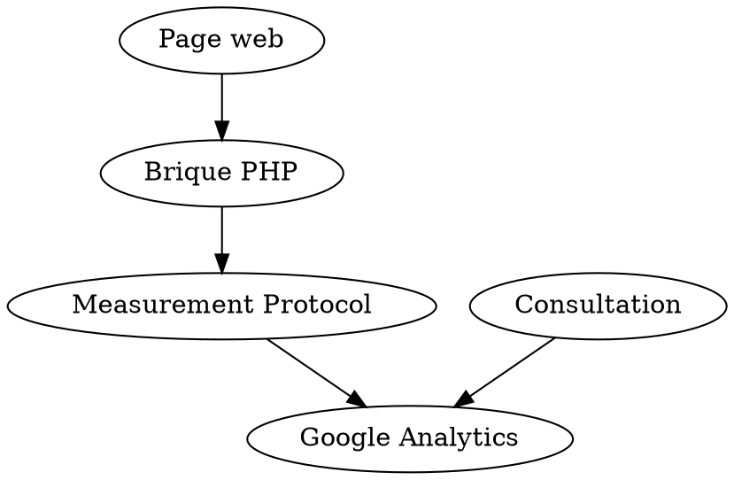
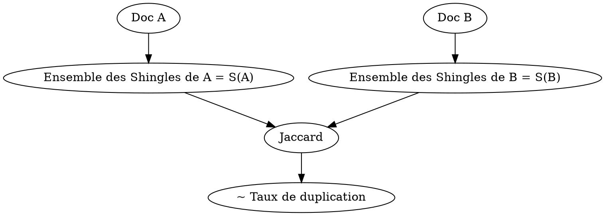

:hammer: FIXME
:books: A lire
:movie_camera: Timing dans video

# SEO - Méthodes d'Optimisation pour les moteurs de recherche

---

>[color=brown] Cours SEO 03 avril 2020

# Introduction
## Petit historique
- 1945: Vannerbush -> MEMEX
- 1957: Mec d'IBM ->
- 60-70: Gerard Salton (Cornell) -> IR, Modèle vectoriel
  - Il a créé un algo utilisé aux années 2000
  - Très utilisé car continuité
- 1989: Tim Berners-Lee invente le web (www)
  - Le bouquin Alexandria à lire
  - Quentin Jardon
- 1991:
  - Le www est rendu public
- 1990: Les moteurs de recherche commencent à apparaitre
  - Archie (Alan Emtage - McGill)
- 1994: Lycos
  - Premier gros moteur de recherche
- 1994: Moteur de recherche Yahoo (Stanford)
- 1995: Moteur de recherche Altavista (par Louis Monier)
- 1998: Moteur de recherche Google (Brin et Larry Page)
  - Bouquin sur Google "In the plex"
  - Brin a mis en place les enchères au second prix pour les pubs
  - les enchères Vickrey
- 1998 - 2010: Moteur de recherche MSN Search / Bing
- 2013: Moteur de recherche Qwant
- Hector Garcia-Molina et Leslie Lemporte et Vandamme (qui a bossé sur la synthèse d'image)
- Les "nouveaux":
  - Yann Lecun (directeur scientifique de Facebook)
  - Geoffrey Hinton
  - Yoshua Bengio
  - Andrew Ng
  - Les pères du machine learning
- Le vrai "nouveau": 
  - Algo qui défonce tout depuis 1970 -> Word2Vec
  - Fasttext -> algo de chez Facebook
- Faiss (je sais pas ce que c'est)

## Définitions
- **Moteur de recherche:** site dont la vocation est de renvoyer des résultats pertinents pour une requête donnée
- **Web:** un grand graphe
- Un **besoin informationnel**  est un sujet sur lequel un utilisateur veut se renseigner:
  - C'est parfois mal défini, ambigu
      - si la requête est Paris, quel besoin avons nous ? La ville de Paris ? Les paris ? Paris Hilton ?
  - Il est différent potentiellement pour chaque personne
  - Une **requête**, c'est ce que l'utilisateur écrit pour communiquer son besoin informationnel
  - ce qui compte ce n'est pas ce que l'on a écrit mais ce que l'on aurait dû écrire si on savait bien écrire
  - un document est pertinent pour une requête s'il répond au besoin info sous-jacent
- Une **SERP** (*search engine result page*)
    - les dix premières pages de pages web mise en avant

### Des chiffres
- **85%** des gens s'arrêtent à la première page de résultats de Google
- **75%** des requêtes ne sont pas reformulées

## Schema global du moteur
page 24 du pdf

### Learning to rank
- Ranknet
- fait une pondération arbitraire et créé des classements
- algo qui calibre le moteur de recherche pour avoir une pondération des pages qui satisfait les utilisateurs (*reçoit un feedback des utilisateurs en fonction de ce qu'ils ont cliqué/visité pour ajuster*)
- il est là pour arbitrer tous les signaux

## Indexation par le crawl
1. Recuperation de la page par le bot (*résolution DNS*):
  - Copie du DNS si on peut (*on crawl beaucoup plus vite que si on doit aller le chercher à l'extérieur -> ~50 fois plus vite*)
  - Sinon on cherche la page sur le web
2. Analyse syntaxique du contenu de la page
3. Contenu déjà vu ?
4. Filtre à URIs
5. Elimination des URIs en duplication
6. Frontières des URIs déjà vues

## Misc
- Nutch
- Bubing
- https://github.com/QwantResearch/mermoz
- Corrélation != Causalité
- Kyle Rush a completement refait l'infrastructure du site de Barack Obama
- RUM: Real User Monitoring
- Cloudflare
- Akamai

## Impact sur le SEO

### Faciliter la vie du crawler
Un bon crawler doit etre:
- rapide -> moins cher en cout serveur
- qualitatif 

### Rapidité
- si un site se charge 2x plus vite, on coute moins cher à Google
- mieux pour l'utilisateur
- améliore son référencement

En 2017, Neil Patel et Ahref ont fait des mesures sur ~144 000 sites pour essayer de comprendre le référencement:
- **TTFB**: Time To First Byte -> 0.85 sec
    - quand je commence à demander une ressource web à un serveur distant, c'est au bout de cb de temps je recois son premier acknowledgment
- **Start render** -> 2.23 sec
    - le moment à partir duquel qqchose apparait sur la page web
- **Visually complete** -> 10.44 sec
    - au bout de cb de temps, tout ce qui doit etre affiché est affiché sur la page (*tout ce qui est chargé après, c'est du script qui n'implique de modifs visuelles*)
- **Doc complete** -> 2.12 sec
    - tout le javascript a fini de chargé
- **Fully loaded** -> 4.13 sec
    - j'ai attendu qques secondes pour m'assurer qu'il n'y a pas de script qui pop/se réactive d'un coup

#### Améliorer la vitesse de chargement
- pour la conversion avant tout (viser 1.5 sec)
- pour le start render (viser 1 sec)
- TTFB -> viser 250ms (Google conseille de faire < 300ms)

#### Analyser la vitesse de chargement
- WebPageTest
- Google PageSpeed Insight
- Sitespeed.io

#### Optimiser le temps de parcours
- approcher le serveur du client
- utiliser un CDN (Content Delivery Network avec Cloudflare)
    - copie du site web sur les serveurs partout dans le monde
    - permet de servir les sites web à partir du serveur le plus proche de l'utilisateur

#### Optimiser le front end
- suivre les recommandations de Google PageSpeed Insight
- poids et taille des images
- nombre d'appels et résolution DNS
- vérif quand et où sont appelés le JS et CSS

#### Optimiser le back end
- Un cache, c'est une bonne pratique:
  - Dans le navigateur
  - Au niveau de la base de données
  - Cache d'OPcode
      - préinterprète une partie du code
- Compresser les pages
- Optimiser la base de données et les requêtes
- Utiliser un serveur web plus léger

>[color=brown] Cours du 16 avril 2020

#### Analyser les logs
- Lister les autres codes http
- Sur les logs, demander le nombre de fois ou la demande est faite a "robots.txt"
- Vis a vis de la RGPD, on doit tout anonymiser. Comme les bots ne sont pas des personnes physiques, on peut montrer les logs de bots.

#### Suivre GoogleBot en temps reel
- cela permet de reagir rapidement en cas d'anomalie
- c'est toujours amusant de voir en temps reel le GoogleBot s'agiter
- on va utiliser le Measurement Protocol de Google pour suivre GGBot dans Google Analytics
  

### Qualité
#### Pas d'interet a crawler des pages inutiles
- on consomme son quota ce crawl sans en retirer aucun benefice
- on ne selectionne pas la page "retenue"
- **"Content is king"**

#### Qualité minimale au moment du crawl
La qualité minimale au moment du crawl est caractérisée par la quantité de contenu qui permet d'indexer la page.

#### Eviter l'indexation
| Type                         | Directive       | crawl | indexation             |
|------------------------------|-----------------|-------|------------------------|
| robots.txt                   | disallow        | non   | parfois                |
| robots.txt                   | noindex         | non   | non                    |
| meta robots (*x-robots-tag*) | noindex, follow | oui   | non                    |
| meta rel (*ou en header*)    | canonical       | oui   | page cible (*souvent*) |

## Duplicate content
**DUST:** **D**uplicate **U**rl, **S**ame **T**ext

### Near Duplicate et Full Duplicate
Le Full Duplicate n'existe pas (ou presque).
- un "." n'est plus du Full Duplicate
- Sauf pour 2 URLs qui pointent sur la meme page

30% du web sont en Near Duplicate

### Detecter le Near Duplicate
#### 1*
- La distance utilisee est de type "distance d'edition".
  - On compte le nombre de modifications qui transforment un document en un autre.
- Distance d'edition standard: Levenstein (1965)
  - Trop complexe pour les documents
  - Utilisee entre deux mots
  - A la place: Shingles et Jaccard (*fonctionne par approximation*)

Fonction de hachage: simhash par Moses Charikar (fast murmur transform)

#### L'idée

Si taux de duplication > 0.8 alors **Alerte Duplication**.
Dépend du type de site:
- s'il s'agit d'un site de e-commerce, il vaut mieux avoir un taux de duplication élevé

#### Shingles
- un k-shingle est un groupe de mots contigus dans le document
- k-shingle = k-gram (*n-gram*) <- on utilise ce terme pour le duplicate content
- on choisit k pour avoir le meilleur rapport détection/temps de calcul (*paramètre lié à l'expérience*)

#### Exemple de 3 shingles
Luke, je suis ton pere!
les shingles:
- Luke je suis
- je suis ton
- suis ton pere
Le document est représenté par un ensemble de 3-shingles.

#### 2*
- quasi-duplication
    - utilisation syntaxique identique sauf sur qques mots
- 2 documents sont en quasi-duplication si et seulement si ils ont presque les memes ensembles de Shingles
- Proportion de shingles en commun (*distance de jaccard*) = taux de duplication

# Les signaux utilisateurs pour optimiser le ranking

## Learning to rank
Calcul la pondération des signaux
En 2008, Amit Singhal -> 200 signaux

- Ranknet
- Lambdamart

**De nombreux signaux:**
- algos structurelles:
  - popularites
  - trust
  - pagerank thematique
  - spam mass (popularite negative)
- liens de wiki, edu, gouv
- ...

Voir pdf page 80
cosinus Y: pertinence de la page par rapport à la requete

### Pertinence implicite
Mesure de qualité:
- taux de click
- clic skip

#### Pour le SEO
Le SEO a deux leviers pour augmenter la qualité perçue par le moteur:
- augmenter l'attractivité des pages en créant des snippets attractifs
- améliorer le ratio rétention - bounce

# Les **pageranks** et les surfeurs **aléatoires**

## Pagerank, la vision classique
- ergodicité (?)
- Damping factor -> la constante de téléportation

### Visualiser la PageRank
- Gephi (open source), logiciel spécialisé en représentation des graphes utilisé avec Screaming Frog
- -> spatialisation

Les Panama papers

modele du surfeur raisonnable, prend en compte la proba qu'un lien est cliqué par rapport à un autre

masquage thématique

C'est possible de prendre en compte la sémantique des liens.

>[color=brown] Cours du 17/04/2020

### Le pagerank vers un pagerank sémantique
**Approches:**
- Le surfeur intelligent: combinaison des valeurs des liens et des contenus pour le calcul de la popularité
  - par Matthew Richardson et Pedro Domingos
- Topic-sensitive pagerank
  - Kaltix
  - par Taher H. Haveliwala
- Topical link analysis (T-PR)

### Le surfeur intelligent
- on modifie le comportement du surfeur aleatoire pour le rendre sensible a la semantique
- il va tjrs sauter de pages en pages de maniere probabiliste, mais il va se baser sur le contenu des pages

indice de continuité sémantique

*Misc:*
  - *tests de chi2*
  - *chernoff hoeding*

Résultats expérimentaux:
- Educrawl
- WebBase (15 millions de pages choisies aléatoirement)

Le surfeur intelligent est trop coûteux donc difficilement implémentable.

Curlie
**SERPs:** Search Engine Results Page

### Cocon semantique
-> entourage de pages
- couvrir davantage le sujet

c'est du *netlinking*

**Un document est pertinent pour une requête s'il répond au besoin informationnel sous-jacent.

**:hammer: reprendre le cours**

Expansion de Rochio

>[color=brown] Cours du 30/04/2020

# Traitement des requêtes 

La requête est le goulot d'etranglement pour ameliorer l'experience de recherche.

Problemes divers:
- Comment exprimer ce que l'on ne connait pas ?
- Nombreuses ambiguites
- Plusieurs besoins informationnels differents pour une meme requête
- Interpretation du langage naturel

Le moteur va faire du raffinement et de l'expansion de requête.

**Raffinement de requete**: Modifier des mots de la requete par d'autres
**Expansion de requete**: Ajout de mots a la requete

5 à 10% des utilisateurs qui partiraient du navigateur si on leur disait qu'on modifie leurs requetes

## Approches les plus efficaces
- Co-occurrence: on ajoute à la requete des termes qui frequemment associés aux termes de la requete
  - Mesure de DICE

### Humming bird
Relevance feedback

- Mesurer la "compatibilité" de 2 termes:
  - mesure de DICE
  - mesure de CHI 2
  - mesure de EMIM
  - mesure de MIM

:hammer: :movie_camera: 
**Gros probleme \~\~\~** (27 min de video)

**Impact SEO:** requete q -> corpus sur la thematique de q -> compter les documents de q -> co-occurence de q -> ~~~

# Vecteurs de contexte
-> embarquent de la sémantique

:books: Vulgarisation de reseaux de neurones: https://twitter.com/gabrielpeyre/status/1255808297460027393?s=20

# Le Knowledge Graph
-> base de connaissances mise en place en 2012
Google l'utilise pour de la désambiguisation

# Les fermes de liens
- page de boost

# Prédiction et penguin - 2h20 (:movie_camera:)

---

:::info
# Notes de cours revisitées
:::