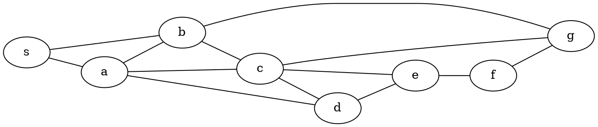
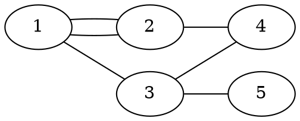

> 01/03/19
# Théorie des graphes
Nb de coups minimum pour résoudre n'importe quelle configuration minimum d'un Rubik's Cube: [20](http://cube20.org/)

Use a Breadth First Search (BFS) to compute the number above.


On part du sommet **s** et on applique l'algo suivant:
```python
adj=[{a,b}, {s,b,c,d}, {s,a,c,g}, ...] #liste d'adjacence
def BFS(adj, s):
    queue = [s]
    seen = {s}
    while queue: # 
        x = queue.pop(0)
        for y in adj[x]:
            if (y not in seen):
                seen.add(y)
                queue.append(y)
# si graphe connexe: |V| = O(E)
```

==excentricité d'un sommet s:== plus grande distance qu'on peut parcourir à partir de s

==rayon d'un graphe:== plus petite excentricité d'un graphe
Le rayon du graphe ci-dessus est 2.
==diamètre d'un graphe:== plus grande excentricité d'un graphe.
Le diamètre du graphe ci-dessus est 3.

```python
#fonction pour calculer l'excentricité
def exc(adj, s):
    cur_level = [s]
    nxt_level = []
    seen = [False] * len(adj)
    seen[s] = True
    depth = 0
    while cur_level:
        for x in cur_level:
            for y in adj[x]:
                if (not seen[y]):
                    nxt_level.append(y)
                    seen[y] = True
        cur_level = nxt_level
        nxt_level = []
        depth += 1
    return depth - 1
```