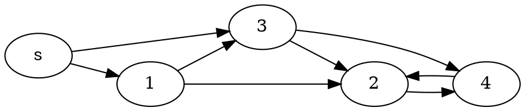

> 08/03/19

# Théorie des graphes
BFS -> carte des distances -> Dijkstra -> Bellman Ford

BFS: distmap(G=(V,E), ==s== $\in$ V) avec ==s==: source sans poids

Pseudo code pour remplir la liste des successeurs à parcourir:

>distmap(G=(V,E), s $\in$ V):
--  $\forall$ v $\in$ V, dist[v] = $\infty$
--  dist[s] = 0
--  todo = [s]
--  while todo $\neq$ []:
------    x = todo.pop_front()
------    for y $\in$ $\delta^+$(x):
----------      if (dist[y] == $\infty$):
------------      dist[y] <- dist[x] + 1
------------      todo.push_back(y)
--  return dist

++Dijkstra simplifié:++
entrée: graphe pondéré, avec poids positifs, s $\in$ V
sortie: dist[y] la distance entre s et y

++Algo de Ballman-Ford++